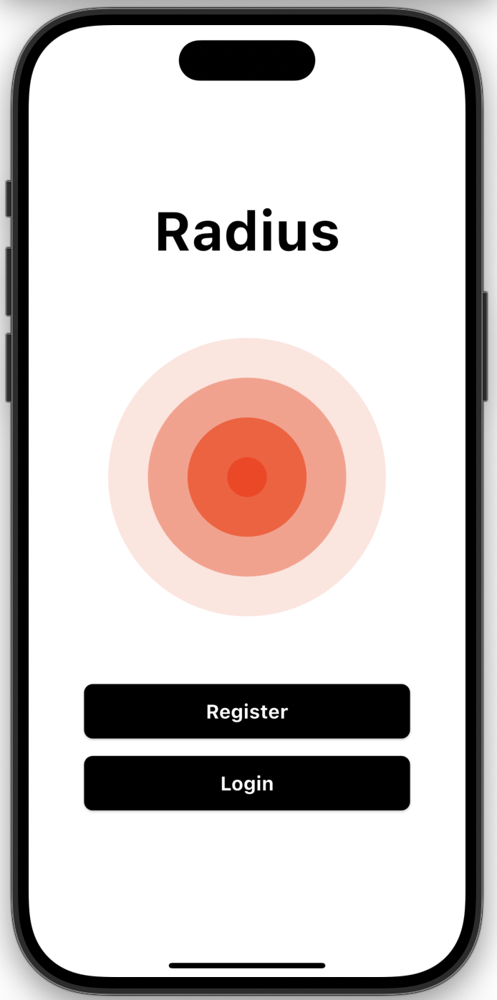

# Radius

A simple and secure real-time team location tracking app built with Flutter and Firebase. Designed for groups that need to stay connected on the move.

  

>[!WARNING]
>This app currently requires the user to stay inside the app for location updates to work. Background updates are not supported yet — will be added in future updates. 
---

## Built With

  

---

## System Architecture

  
  

---

## Screenshots

  
  
  
  
  
  

---

<em>Just an implementation of</em>

<em>which won the 2nd runner-up position in <strong>Codevolt (organised by Raptee.hv and Zoho)</strong> and was ideated and built by</em>

  
  
  
  
  

